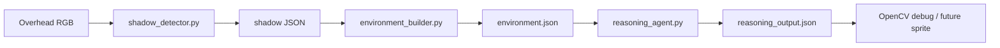

# Weekly Sprint — Shadow Contour + Reasoning Agent MVP

## One-line summary

Fixed overhead RGB captures shadow regions as structured JSON; a rule-based agent reads `environment.json` and emits `reasoning_output.json` with paths, states, and reasons—no LLM in the closed loop.

## Data chain

## Deliverables (this repo)

| Artifact | Location |
|----------|----------|
| Shadow detector | `peter_pan/perception/shadow_detector.py` |
| Environment builder | `peter_pan/perception/environment_builder.py` |
| Reasoning agent | `peter_pan/agent_brain/reasoning_agent.py` |
| Debug visualization | `peter_pan/perception/shadow_debug.py` |
| Live demo | `scripts/run_shadow_demo.py` |
| Offline reasoning | `scripts/run_reasoning_offline.py` |
| Examples | `examples/*.json` |

## Risks and mitigations (from PRD)

- **Projection interference**: capture background with projection off or use a static frame; tune `darkness_threshold` in `config.yaml`.
- **LLM instability**: not used in the loop; `RuleBasedReasoningAgent` is deterministic.
- **No object detector yet**: book positions are configured under `environment_builder.objects` in `config.yaml`.

## Demo checklist (30–60 s)

1. Start `python -m scripts.run_shadow_demo`, press **b** with a clean table.
2. Move hand to cast shadow; confirm mask and contour in the composite view.
3. Adjust `objects` or shadow to see path / `high_level_action` change in console or saved JSON.
4. Press **s** to write `outputs/environment.json` and `reasoning_output.json`.
